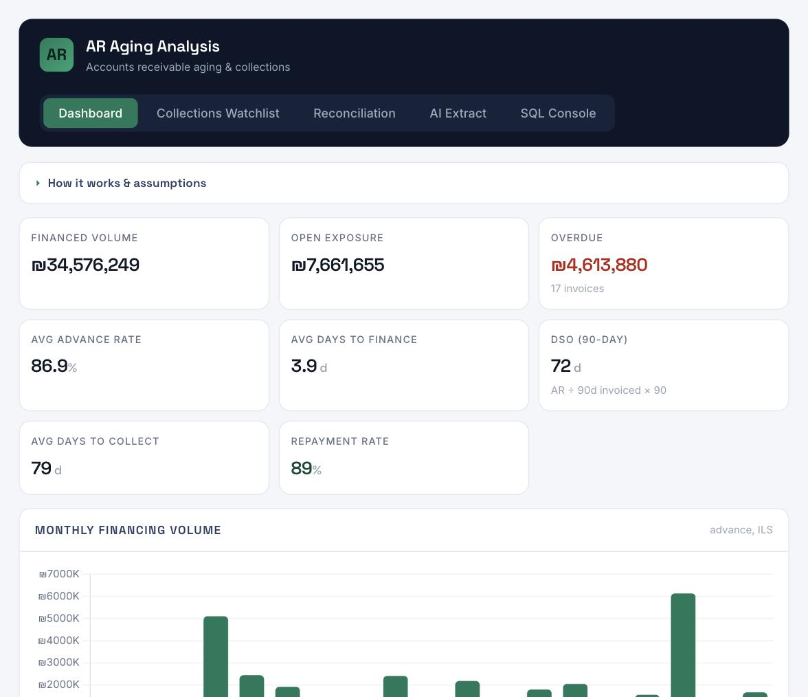
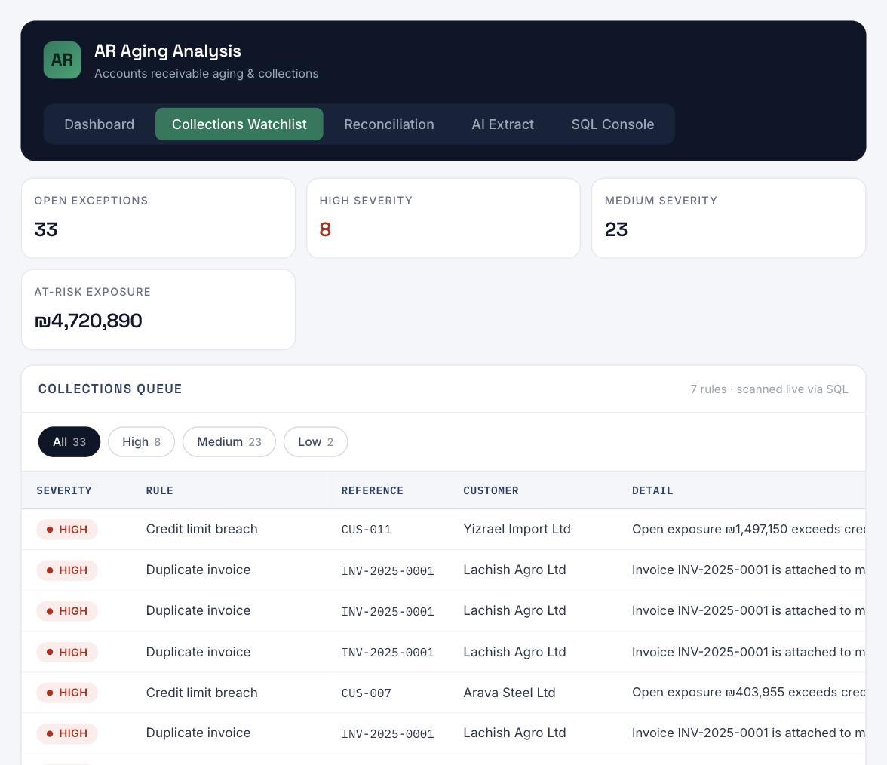

# AR Aging Analysis — Accounts Receivable Aging & Collections Console

A browser-based accounts-receivable aging and collections console. It runs a
**real SQLite database in the browser** (via WebAssembly), drives every dashboard
number from **live SQL**, flags collection risks with a **rule-based watchlist
engine**, and uses an **LLM to read invoices** and cross-check them against the
ledger.

Built as a portfolio project to demonstrate SQL, data modelling, BI dashboards,
exception handling, and applied AI on a realistic fintech operations problem.

> **Live demo:** https://barbarzilay100-coder.github.io/ar-aging-analysis/





---

## What it does

| Module | What it demonstrates |
|---|---|
| **Dashboard** | KPIs (financed volume, open exposure, overdue, DSO, avg advance rate, repayment rate), monthly trend, status split, top customers, receivables aging — each one a live SQL query. |
| **Collections Watchlist** | 7 SQL rules that scan the ledger and flag duplicates, credit-limit breaches, advance mismatches, overdue receivables, high-risk exposure and stuck invoices — with severity and at-risk exposure. |
| **AI Extract** | Paste an invoice → an LLM extracts structured fields → the app cross-checks them against the database (duplicate invoice, known/new customer, remaining credit room, amount sanity, date integrity) and returns a risk summary. |
| **SQL Console** | A query editor over the live database with a schema browser and preset queries — the SQL behind the dashboard is fully inspectable. |

## Architecture

```
Browser (single static page, no backend)
 ├─ sql.js (SQLite compiled to WebAssembly) ....... the data layer
 │    schema.sql  →  customers / deals / deal_events
 ├─ Chart.js ...................................... dashboard visuals
 ├─ Collections watchlist ......................... queries.sql, section B
 ├─ Live FX (open.er-api.com) ..................... USD/EUR → ILS on load
 └─ Anthropic Messages API ........................ invoice field extraction
```

Everything is client-side: no server, no build step. The ledger is generated
deterministically on load (fixed seed); non-ILS invoices are converted to ILS
using the latest published exchange rate, fetched live when the page loads (with a
fixed fallback if the rate service is unavailable).

## Project structure

```
ar-aging-analysis/
├─ index.html        markup + external asset links
├─ styles.css        all styling
├─ app.js            data layer, dashboard, watchlist engine, AI, SQL console
├─ sql/
│  ├─ schema.sql     relational schema
│  └─ queries.sql    analytics queries + collection rules
├─ docs/             screenshots
├─ README.md
└─ LICENSE
```

## Data model

Three related tables (`sql/schema.sql`):

- **customers** — tracked counterparties, credit rating and limit.
- **deals** — the core ledger: one row per invoice, its advance, fee, status and risk (amounts normalised to ILS).
- **deal_events** — lifecycle audit trail (created → submitted → reviewed → financed → repaid).

## Collections rules

All rules live in `sql/queries.sql` (section B). Summary:

| # | Rule | Severity |
|---|---|---|
| B1 | Duplicate invoice number | High |
| B2 | Advance exceeds invoice value | High |
| B3 | Customer exposure over credit limit | High |
| B4 | Advance ≠ invoice × advance rate | Medium |
| B5 | Overdue receivable | Medium |
| B6 | High-risk invoice financed (score ≥ 75) | Medium |
| B7 | Invoice stuck in pipeline > 10 days | Low |

## Run locally

It's a single static page — just open it:

```bash
# any static server works; for example:
python3 -m http.server 8000
# then visit http://localhost:8000
```

Or open `index.html` directly in a browser.

## Deploy (GitHub Pages)

```bash
git init
git add .
git commit -m "AR Aging Analysis — accounts receivable aging console"
git branch -M main
git remote add origin https://github.com/<you>/ar-aging-analysis.git
git push -u origin main
```

Then in the repo: **Settings → Pages → Source: `main` / root**. The live URL
appears within a minute.

## AI extraction setup

- **Inside the Claude runtime**, the extraction call is handled for you — no key needed.
- **Self-hosted** (GitHub Pages), paste your own Anthropic API key into the field on
  the AI Extract tab. It's held in memory only — never stored, never committed.
- With no key and outside Claude, the app falls back to a local heuristic parser so
  the cross-check still demonstrates.

> Security note: a client-side page can't hide an API key. The key field is for
> local/demo use with your own key. For production you'd proxy the call through a
> small backend so the key stays server-side.

## Tech stack

`sql.js` (SQLite/WASM) · `Chart.js` · vanilla JS/HTML/CSS · live FX (open.er-api.com) · Anthropic Messages API

## Notes on the data

The dataset is **synthetic** — 30 customers and 180 invoices generated from a fixed
seed to model a realistic receivables book (including deliberate data-quality issues
for the watchlist to catch). All dates are generated **relative to today**, so the
ledger always looks current. The structure of the book is deterministic (same seed,
same customers/invoices/statuses); ILS amounts of non-ILS invoices are converted at
the latest published FX rate, so those figures move slightly with the market. No real
customer data is used.

## License

MIT — see `LICENSE`.
